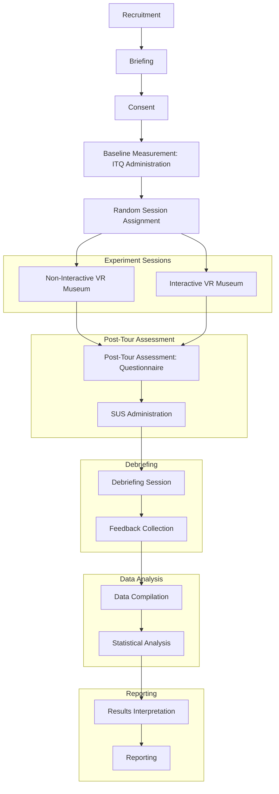

# Traditional Mask Museum

# Introduction
The integration of virtual reality (VR) technology in museums presents a significant opportunity to enhance user engagement, learning outcomes, and overall user experience. Previous research has shown that VR technology can enhance learning effectiveness and user experience by increasing perceived presence, immersion, realism, and satisfaction​​. However, these outcomes can vary significantly based on the level of interactivity and the design of the VR interface. 

This study aims to explore the effects of different levels of interactivity in VR museum exhibits on these variables, specifically focusing on Balinese traditional masks. Two VR museums will be created: one with static displays and plain sight explanations, and another with enhanced interactivity, including features such as holding the masks virtually and multimedia content like sound explanations.

By investigating these differences, this study aims to provide empirical evidence on the impact of VR interactivity in digital museums, contributing to the development of more effective and engaging VR educational tools. This research will utilize quantitative methods to measure engagement, comprehension, and usability, including time spent on tours, questionnaire scores, and System Usability Scale (SUS) scores. The findings will help in understanding how different VR designs can influence user experiences and learning outcomes, thereby supporting the hypothesis that increased interactivity enhances the effectiveness of VR museum exhibits.


# Research Questions

**Main Question:**
- How do different levels of interactivity in VR museum exhibits affect user engagement, learning outcomes, and user experience among university students?

**Sub-Questions:**
1. Does the interactive VR museum enhance user engagement compared to the non-interactive VR museum?
2. What is the impact of interactivity on the understanding and retention of information about Balinese traditional masks?
3. How does the ease of use differ between the interactive and non-interactive VR museum exhibits?

# Hypothesis
## Null Hypothesis (H0)
There is no significant improvement in user engagement, comprehension and retention of information, or usability scores when comparing the interactive VR museum to the non-interactive VR museum.

## Alternative Hypothesis (H1)
The interactive VR museum enhances user engagement, understanding and retention of information, and usability scores significantly more than the non-interactive VR museum.


# Independent Variable
The knowledge and mask material is gathered from House of Mask and Puppets Setia Darma Gianyar. The full list of mask classes can be found in [Mask Knowledge.md](./Mask%20Knowledge.md).

The primary independent variable in this study is the type of VR museum exhibit, which consists of two different settings designed to exhibit Balinese traditional masks.  These settings are defined as follows:

1. **Non-Interactive VR Museum**:
    - This setting presents the masks in a static display format.
    - Explanations of each mask’s cultural and historical significance are provided in plain sight, similar to traditional museum exhibits.
    - Users can navigate through the museum but cannot interact with the masks beyond viewing them and reading the provided descriptions.

    

2. **Interactive VR Museum**:
    - This setting enhances user interactivity with the exhibits.
    - Users can virtually hold the masks, allowing them to examine them in more detail.
    - Interactive features include zooming in for detailed textures, rotating the masks for different views, and accessing multimedia descriptions.
    - The multimedia content includes audio explanations that provide historical context, usage in cultural ceremonies, and associated myths.

      https://github.com/tdpg20232a/final-project-bali-aga/assets/28553885/e265ebba-dae7-4921-a08f-ba5537350644

By differentiating the design of the VR application between these two settings, this study aims to assess how varying levels of interactivity influence user engagement, learning outcomes, and overall user experience. The independent variable's manipulation allows for a direct comparison between a traditional, non-interactive presentation and an immersive, interactive experience.

In addition to the primary independent variable, several controlled variables will be maintained to ensure consistency across both museum settings:
- **Content Consistency**: The cultural and historical information provided about each mask will be identical in both settings to isolate the impact of interactivity.
- **Navigation Experience**: The navigation mechanics (e.g., movement through the museum space) will be consistent between the two settings to avoid confounding the results with differences in navigation ease or comfort.
- **Participant Demographics**: The study will target Balinese university students majoring in Information Technology, aged 20-22, to control for potential variations in background knowledge or familiarity with VR technology.

This approach will allow for a focused investigation into how the level of interactivity within a VR museum setting affects user engagement, comprehension, and retention of information, and usability, supporting the study's hypotheses.

# Dependent Variables

## User Engagement

### Time to Complete the Tour
The time participants spend on each museum tour can indicate their level of engagement. Longer times might reflect higher engagement, especially if the time is spent interacting with the exhibits in the interactive VR museum.

### ITQ (Immersive Tendencies Questionnaire)
The Immersive Tendencies Questionnaire (ITQ), developed by Witmer and Singer (1998), is a widely used tool to measure an individual's predisposition towards immersion in various activities, such as books, movies, and computer games. The ITQ consists of 18 items rated on a 7-point scale (1 = never, 7 = often), and it evaluates three main subdimensions: involvement, attentional focus, and the tendency to play video games. These subdimensions help assess how likely an individual is to become deeply involved in an immersive environment, which is crucial for understanding baseline differences in engagement with VR experiences.

Its use in this study will help account for individual differences in baseline immersive tendencies, ensuring that variations in engagement, comprehension, and usability are attributed to the level of interactivity in the VR museum settings rather than inherent predispositions.

## Comprehension and Retention of Information

### Post-Tour Question
The questionn administered after each tour will assess the participants' understanding and retention of the information presented. Higher scores on the post-tour questionnaire for the interactive museum would support H1.

## Usability Scores:

### SUS (System Usability Scale)
The System Usability Scale (SUS) is a reliable, low-cost tool for measuring the usability of a wide range of products and services, including hardware, software, mobile devices, websites, and applications. Developed by John Brooke in 1986, SUS has become a standard in the usability field due to its simplicity and effectiveness.

SUS consists of a 10-item questionnaire with five response options for respondents, ranging from "Strongly agree" to "Strongly disagree." The items alternate between positive and negative statements to reduce response bias. The SUS score is calculated by converting the responses to a 0-100 scale, with higher scores indicating better usability.

## Hypotheses and Measurement Methods Mapping

| Hypothesis            | Measurement Method              | Dependent Variable           | Assessment Tool               |
|-----------------------|---------------------------------|------------------------------|--------------------------------|
| User Engagement       | Time to Complete the Tour       | Engagement                   | Time recorded during tour      |
| User Engagement       | ITQ Questionnaire                           | Baseline immersive tendencies| ITQ scores before tours        |
| Comprehension & Retention | Mask Knowledge Assesment     | Understanding and Retention  | Questionnaire scores           |
| Usability             | SUS Questionnaire                             | Usability  | SUS Questionnaire after tour

# Apparatus and Material

To conduct this study, the following apparatus and materials will be used:

1. **VR Headsets**: High-quality VR headsets such as the Oculus Rift or HTC Vive will be used to provide an immersive virtual reality experience for participants. These headsets will be used to display both the interactive and non-interactive VR museum settings.

2. **Computers**: High-performance computers with the necessary specifications to run VR applications smoothly.

3. **VR Controllers**: Handheld VR controllers compatible with the VR headsets. These controllers will allow users to interact with the virtual objects, such as holding and rotating the masks in the interactive VR museum setting.

5. **Audio Equipment**: High-quality headphones to deliver immersive audio explanations and background sounds within the VR environments. This equipment will enhance the realism and engagement of the VR experience.

6. **Questionnaires**: Digital versions of the ITQ (Immersive Tendencies Questionnaire) and SUS (System Usability Scale) questionnaires. These will be used to assess baseline immersive tendencies, usability, and other relevant metrics.

8. **Environment Setup**: A quiet room with minimal distractions where participants can use the VR equipment comfortably.

# Subjects

The study will involve participants who are Balinese university students majoring in Information Technology, aged 20-22. This demographic is chosen for several reasons:

1. **Relevance**: University students in this age range are generally more familiar with digital technologies and more likely to have previous exposure to VR environments, making them suitable candidates for this study.
2. **Availability**: University students are typically more accessible for academic research and more willing to participate in studies related to educational technology.

Based on the subjects, this study will have some limitation

1. **Generalizability**: The study’s findings may not be generalizable to other age groups or individuals with different educational backgrounds.
2. **Cultural Context**: The study focuses on Balinese traditional masks and Balinese students, which may limit the applicability of the results to other cultural contexts or regions. 
3. **Sample Size**: The study is limited by the number of available participants within the specified demographic.

# Experiment Procedure

#### Preparation
1. **Recruitment**: Recruit Balinese university students majoring in Information Technology, aged 20-22.
2. **Briefing**: Provide an overview of the study, including its purpose and what participation involves.
3. **Consent**: Obtain informed consent from all participants.

#### Baseline Measurement
1. **ITQ Administration**: Have participants complete the Immersive Tendencies Questionnaire (ITQ) to assess their baseline immersive tendencies.

#### Experiment Sessions
1. **Session Assignment**: Randomly assign participants to experience either the non-interactive or interactive VR museum first.
2. **Non-Interactive VR Museum**:
    - Participants explore the static VR museum with plain sight explanations.
    - Record the time spent on the tour.
3. **Interactive VR Museum**:
    - Participants interact with the VR museum, using features like zooming, rotating masks, and accessing multimedia content.
    - Record the time spent on the tour.

#### Post-Tour Assessment
1. **Post-Tour Questionnaire**: Administer a questionnaire to assess participants' understanding and retention of information about the masks.
2. **SUS Administration**: Have participants complete the System Usability Scale (SUS) to evaluate the usability of the VR application.

#### Debriefing
1. **Debriefing Session**: Provide a debriefing session to explain the study's purpose and answer any questions.
2. **Feedback Collection**: Collect feedback from participants about their experience in both VR museum settings.

#### Data Analysis
1. **Data Compilation**: Compile data from ITQ, time spent, post-tour questionnaire, and SUS scores.
2. **Statistical Analysis**: Conduct statistical analyses to compare user engagement, comprehension, retention, and usability between the non-interactive and interactive VR museums.

#### Reporting
1. **Results Interpretation**: Interpret the results in the context of the study's hypotheses.
2. **Reporting**: Prepare a detailed report of the findings, including statistical outcomes and implications for future VR museum designs.



### Data Analysis

The data collected from the experiment will be analyzed using the Mann-Whitney U test to determine if there are significant differences between the non-interactive and interactive VR museum settings. This non-parametric test is suitable for comparing two independent groups when the assumptions of normality are not met. The steps for conducting the analysis are as follows:

1. **Data Compilation**:
    - Compile the data from ITQ, time spent on tours, post-tour questionnaires, and SUS scores for both VR museum settings.

2. **Descriptive Statistics**:
    - Calculate the median and interquartile range (IQR) for each dependent variable in both group.

3. **Mann-Whitney U Test**:
    - Formulate the null hypothesis (H0): There is no significant difference between the non-interactive and interactive VR museum settings for each dependent variable.
    - Formulate the alternative hypothesis (H1): There is a significant difference between the non-interactive and interactive VR museum settings for each dependent variable.
    - Perform the Mann-Whitney U test for each dependent variable using Python.

4. **Interpretation of Results**:
    - Compare the U statistic to the critical value from the Mann-Whitney U distribution table and p-value
    - If the p-value is less than the significance level (typically 0.05), reject the null hypothesis in favor of the alternative hypothesis, indicating a significant difference between the groups.

5. **Reporting**:
    - Report the median, IQR, U statistic, and p-value for each dependent variable.
    Example:
```markdown
### Results

- **Median Engagement Time**:
  - Non-Interactive VR Museum: X minutes
  - Interactive VR Museum: Y minutes
- **Mann-Whitney U Test**: U = U_value, p = p_value

- **Median ITQ Scores**:
  - Non-Interactive VR Museum: X
  - Interactive VR Museum: Y
- **Mann-Whitney U Test**: U = U_value, p = p_value

- **Median Post-Tour Questionnaire Scores**:
  - Non-Interactive VR Museum: X
  - Interactive VR Museum: Y
- **Mann-Whitney U Test**: U = U_value, p = p_value

- **Median SUS Scores**:
  - Non-Interactive VR Museum: X
  - Interactive VR Museum: Y
- **Mann-Whitney U Test**: U = U_value, p = p_value
```

### References
- Pei, X., Fu, S., & Jiang, T. (Year). An empirical study on user experience evaluation of VR interface in digital museums. *School of Information Management, Wuhan University, Wuhan, Hubei, China*; *Center for Studies of Information Resources, Wuhan University, Wuhan, Hubei, China*.
- Witmer, B.G., & Singer, M.J. (1998). Measuring presence in virtual environments: A presence questionnaire. Presence: Teleoperators and Virtual Environments, 7(3), 225-240.
- Frontiers in Psychology. (2023). Measuring Immersion, Involvement, and Attention Focusing Tendencies in the Mediated Environment: The Applicability of the Immersive Tendencies Questionnaire. [Link to study](https://www.frontiersin.org/articles/10.3389/fpsyg.2023.00001/full)
